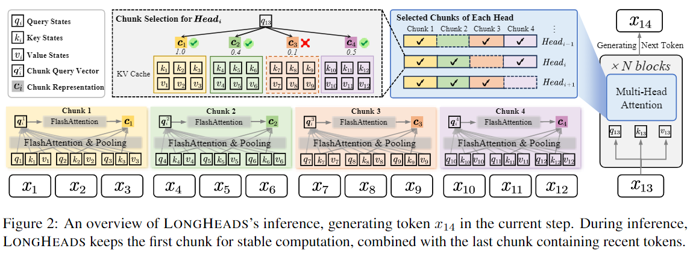

# LongHeads: Multi-Head Attention is Secretly a Long Context Processor [[paper](https://arxiv.org/abs/2402.10685)]
### News
- [2024/03/25] We successfully offload the KV cache to CPU during inference. This implementation significantly reduces memory usage and enables LLaMA-2-7b to achieve 100% accuracy with **128k** context on passkey retrieval task!!! 
- [2024/03/25] We release the evaluation code for the passkey retrieval task.
- [2024/03/24] We release the example code for LongHeads.
### Overview
LongHeads is a training-free framework for extending the context window of large language models (LLMs) to more than 32x times their original pre-training length. LongHeads works efficiently in linear time, fits seamlessly with many LLMs that use relative positional encoding and can be integrated with popular extrapolation methods such as [Positional Interpolation (PI)](https://arxiv.org/abs/2306.15595) and [NTK-Dynamic RoPE](https://www.reddit.com/r/LocalLLaMA/comments/14mrgpr/dynamically_scaled_rope_further_increases/).



### 🚀Quick Start
#### Environment Setup
```bash
pip install -r requirements.txt
# We use flash-attn==2.3.6
pip install flash-attn --no-build-isolation (FlashAttention >= 2.3.6)
```
#### Load model with LongHeads
```bash
# load longheads model
from modeling_longheads import LlamaForCausalLM
longheads_config = {
    # chunk size setting for longheads
    'window_size':256,
    # the attention window length of longheads (atten_length should be smaller to model's pretrained length)
    'atten_length':4096,
    # during encoding phrase, we use this praram to begin streamingly encoding long context with chunk selection strategy
    'begin_selective_length':4096,
    # whether offload KV cache to cpu memory, if True longheads can generate to 128k+ context length
    'cpu_offload':False,
    # whether use batch_encoding for encoding phrase acceleration, if True more memory will be needed
    'batch_encoding':False,
    # the hyper param for batch encoding
    'encoding_batch_size':128,
}
model = LlamaForCausalLM.from_pretrained("meta-llama/Llama-2-7b-hf", torch_dtype=torch.float16, **longheads_config)
```
#### Run Inference Example
```bash 
python example.py
```

### Passkey Retrieval
#### LongHeads 128k
We successfully extend LLaMA-2-7b to 128k with LongHeads without additional training and achieve 100% accuracy with **128k** context on passkey retrieval task! With offloading the KV cache to CPU, peak GPU memory usage is 44.484 GB when inference with 128k context.


#### Evaluation
```bash
bash /passkey_retrieval/passkey_retrieval_script.sh
```

### TODOs
We will release the code in the following order, please stay tuned!

- [x] Release core code of LongHeads.
- [x] Release example code for usage.
- [x] Release passkey retrieval evaluation code.
- [ ] Release code of LongHeads with efficient implementation.

### Citation

If you find LongHeads useful or relevant to your project and research, please kindly cite our paper:

```bibtex
@misc{lu2024longheads,
      title={LongHeads: Multi-Head Attention is Secretly a Long Context Processor}, 
      author={Yi Lu and Xin Zhou and Wei He and Jun Zhao and Tao Ji and Tao Gui and Qi Zhang and Xuanjing Huang},
      year={2024},
      eprint={2402.10685},
      archivePrefix={arXiv},
      primaryClass={cs.CL}
}
```
